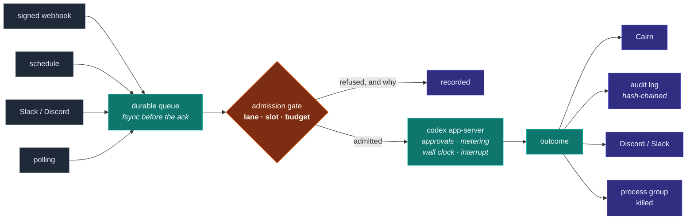

<div align="center">

# Bothy

### A small agent harness you can leave somewhere.

*Wakes on signed webhooks, schedules, chat or polling.*
*Runs Codex under supervision. Remembers in Cairn.*
*Speaks up when it needs you. Closed to everything but the tailnet.*

`stdlib only` · `no virtualenv` · `no build step` · `~8k lines` · `176 tests`

</div>

---

A **bothy** is an unlocked shelter in the Scottish hills. Nobody staffs it. It
looks after itself. Whoever passes through can use it, and it is still standing
when they leave.

That is the whole design brief. Bothy is the agent harness you install on a
client's Mac mini, walk away from, and monitor from a distance.



## Why it is small

The systems Bothy learns from are excellent and very large. One is 182 MB of
bundled JavaScript across 109 SQLite tables. Another is ~1.9M lines of Python
whose own maintainers name its install path as the main obstacle to handing it to
anyone — a 3,945-line installer that refuses to run headless, and 939
configuration keys with no way to ship one vetted profile to many sites.

Bothy is the part you can read in an afternoon and defend to a client.

It does not replace those systems. It is what you deploy when the thing has to
run somewhere you cannot reach, on hardware you do not own, for someone who will
phone you when it breaks.

## Six ideas it is built on

Every one was bought with somebody's outage. The full list, with the incident
behind each, is in **[docs/DESIGN.md](docs/DESIGN.md)**.

**Budget is reserved, never measured.** With several runs in flight, *"are we
under the cap"* cannot be answered by looking — five runs each see `$40 of $50`
and all five start. So a run leases its worst case before it begins and settles
at the end. Money is an exclusive slot like any other, and a crashed run's lease
expires.

**Workers are killed as process groups.** A Codex app-server is a tree.
Signalling the parent leaves the rest alive — thirteen orphans on one host, and
196 children plus $1,193 in one documented runaway.

**`fsync`, then acknowledge.** A mature broker shipped the opposite as a headline
feature and later deleted it, status code and all, because a buffer that had not
reached disk could not deliver the durability it promised.

**Refusals are events.** *"It did not start, and which gate said no"* is the
question an operator actually asks. And a refusal is retried, counted, and
eventually abandoned **out loud** — never retried forever.

**Liveness is proven, not assumed.** A zombie process satisfies
`killpg(pgid, 0)`; Bothy enumerates the group and ignores the dead. *(That one
was found here, not inherited.)*

**A signature authenticates the sender, not the content.** A verified GitHub
webhook proves GitHub sent it. The pull request title inside was written by a
stranger — and the prompt says so.

## Try it

```bash
export BOTHY_HOME=~/.bothy && mkdir -p $BOTHY_HOME
cat > $BOTHY_HOME/config.json <<'JSON'
{
  "site": "acme-mini",
  "workspace": "/srv/work",
  "pool":   { "max_workers": 2 },
  "budget": { "mode": "api", "per_run_usd": 0.50, "per_day_usd": 25.0 }
}
JSON

bin/bothy doctor
bin/bothy run "Summarise what changed this week" --subject weekly --ref ACME-12
bin/bothy status
```

```console
$ bin/bothy doctor
  [ok  ] state directory writable: /home/you/.bothy/state
  [ok  ] audit chain intact: 14 records verified
  [ok  ] codex present: codex-cli 0.154.0
  [ok  ] cairn reachable: memory and task ledger
  [ok  ] no orphaned workers: 0 process group(s) left by a previous instance
  [warn] sandbox can start: bwrap: loopback: Operation not permitted — runs needing a shell will fail
  [warn] alert route configured: a failure nobody hears about is not handled

$ bin/bothy run "Reply with exactly: BOTHY" --subject demo
completed  run_20260918T061227Z_a5b90382  0.0199 usd
  BOTHY
```

And when it should not run, it says so in terms you can act on:

```console
$ bin/bothy run "..." --subject demo
refused  run_20260918T061120Z_b3ec3ddd  0.0000 percent
  refused at gate 'budget': would reach 99.00 percent against a 85.00 ceiling
  (97.00 used, 0.00 already reserved, 2.00 requested)
  → resets 2026-09-20T11:31:42+00:00
```

## Four ways to wake it

| | ingress | latency | the gate |
|---|---|---|---|
| **Webhook** *(tailnet)* | tailnet only | instant | signature **and** tailnet identity |
| **Webhook** *(Funnel)* | one path, public | instant | the signature, entirely |
| **Slack / Discord** | none — outbound socket | instant | allowlist, deny by default |
| **Polling** | **none at all** | seconds–minutes | nothing to gate; you called them |

Funnel is **per-port, not per-path**, so public routes get their own listener and
tailnet routes sit on a port Funnel is not permitted to touch. For a nervous
client, polling means you can say *"nothing on this machine accepts a connection
from the internet"* and mean it.

## Capability is per job

A worker starts with **nothing** beyond Codex's built-ins. A named profile grants
MCP servers, skill roots, a sandbox — and individual **tools**, because
`mcp: gmail` reads as harmless while possibly including `send`.

```json
"profiles": {
  "mail": {
    "mcp_servers": { "gmail": { "command": "mcp-gmail", "env_vars": ["GMAIL_TOKEN"] } },
    "mcp_tools":   { "gmail": ["search", "read_message", "send_message"] },
    "mcp_ask":     { "gmail": ["send_message"] }
  }
}
```

Bothy also hosts tools of its own over the same connection — no subprocess, no
port, no credential. That is how the agent maintains its own standing checklist:

```console
$ bothy run "read the checklist, add an item about the audit chain" --profile selfcare
completed  run_20260918T064159Z_0de1a197  0.0616 usd

$ bothy checklist
- Disk on / should stay under 85%.
- Verify the audit chain is intact, with no missing or invalid links.   ← the agent wrote this
```

## Install

```bash
sudo bin/bothy install --dry-run     # exactly what it will touch
sudo bin/bothy install --serve       # launchd or systemd, + tailscale serve
bin/bothy funnel                     # the tailscale commands your config implies
```

One command, no prompts, no TTY, idempotent, non-zero on failure. The exit code
is a contract — `75` restart me, `78` stop — and the two service managers need
**opposite** handling of it, which is in [docs/OPERATING.md](docs/OPERATING.md).

## Layout

| | |
|---|---|
| `clock` `ids` | Time with an offset, monotonic deadlines, one run id per run |
| `audit` | Append-only, hash-chained, verifiable across rotation |
| `budget` `pool` | Reservations, subject lanes, a pool that heals itself |
| `proc` `lifecycle` | Process groups, zombie-aware liveness, the 75/78 contract |
| `codex` `capability` | The app-server client; profiles and Bothy-hosted tools |
| `wake` `poll` `slack` `discord` `ws` | Four ways in, on one durable queue |
| `tailnet` `ratelimit` `install` | Who is calling, how often, and putting it on a machine |
| `runner` `daemon` `schedule` `cronspec` | One run door-to-record; four loops; the heartbeat |
| `tracker` `alert` `retention` `config` | Cairn, saying something, sweeping up, the whole surface |

`bothy/vendor/a2a_reactor/` is vendored verbatim from
[a2a-comms](https://github.com/montytorr/a2a-comms) (MIT). Do not edit it.

## Tests

```bash
make check     # quiet, non-zero on failure
make test      # verbose
```

**176 tests, standard library `unittest`.** They assert *properties*, and each
was demonstrated by hand against the real thing — real Codex, the real GitHub
API, a real systemd install — **before** being written down. The tests are
recorded evidence, not a guess at what the code does.

The WebSocket tests use **RFC 6455's own vectors**, because a test built from the
same misunderstanding as the code will agree with it happily. The suite also
checks on itself — a minimum collected count and that every module imports —
since *"a test suite that has never executed is not coverage"*.

Several tests exist only to pin a bug found the hard way, and say so in their
docstring.

## Status

Built and proven end to end against a real Codex app-server, the real GitHub API
and a real systemd install: supervised turns, parallel runs, budget refusal on
live quota, crash recovery under `SIGKILL`, a heartbeat that woke itself and
reported a genuine sandbox failure, and a hash-chained audit trail joining all of
it by run id.

**Not proven:** no live Slack workspace and no live Discord application have ever
been connected, and it has not yet run on a Mac mini. The protocols, ack
discipline, allowlists and lane keying are proven against fakes and against the
RFC — the credentials paths are not.

## Documentation

- **[docs/DESIGN.md](docs/DESIGN.md)** — the rules, and the outage that bought each
- **[docs/OPERATING.md](docs/OPERATING.md)** — the runbook
- **[docs/CONFIG.md](docs/CONFIG.md)** — every setting, and why each has a safe default

## Licence

MIT.
